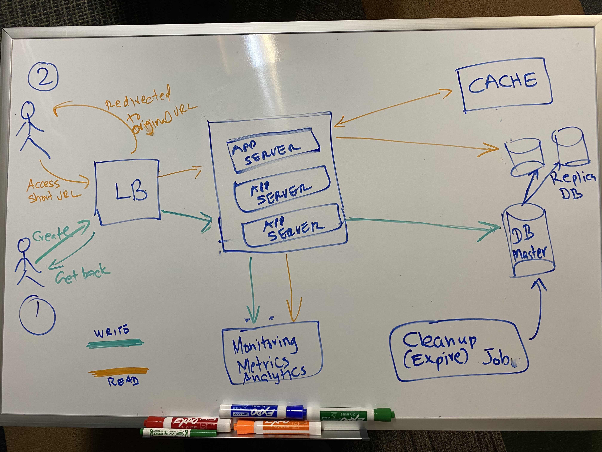

# Intro
A URL Shortener that provides api endpoints to shorten a given URL and expand the shortened URL and redirect to the original URL

## Use cases and assumptions

* A registered user creates a shortened url using the service
* Any user can hit the shortened url (and will be redirected to the underlying URL)
* No modification (update or delete) on an already created short urls is supported
* Duplicate original urls are allowed (explain!)
* No custom url is allowed (for simplicity)
* Short urls expire after a year

## Sample calls
### Create a short url
```console
curl -s 'localhost:8080/api/v1/create' -d '{"longURL":"https://www.cnn.com/2023/02/01/us/washington-hinman-glacier-disappear-climate/index.html", "userId":"abcdefgh"}' -H 'Content-Type: application/json
```
```javascript
{
  "longURL": "https://www.cnn.com/2023/02/01/us/washington-hinman-glacier-disappear-climate/index.html",
  "userId": "abcdefgh",
  "created": "2023-02-01-02 13:12:19",
  "expiration": "2024-02-01-02 13:12:19",
  "shortURL": "https://www.shorturl.com/fA6nvDqxL"
}
```

### Expand a valid short url
```console
curl -v 'http://localhost:8080/fA6nvDqxL'
```
```console
*   Trying 127.0.0.1:8080...
* Connected to localhost (127.0.0.1) port 8080 (#0)
> GET /fA6nvDqxL HTTP/1.1
> Host: localhost:8080
> User-Agent: curl/7.85.0
> Accept: */*
>
* Mark bundle as not supporting multiuse
< HTTP/1.1 302
< Location: https://www.cnn.com/2023/02/01/us/washington-hinman-glacier-disappear-climate/index.html
< Content-Language: en-US
< Content-Length: 0
< Date: Wed, 01 Feb 2023 18:13:56 GMT
<
* Connection #0 to host localhost left intact
```
## Expand an invalid short url
```console
curl -v 'http://localhost:8080/abcd'
```

```console
*   Trying 127.0.0.1:8080...
* Connected to localhost (127.0.0.1) port 8080 (#0)
> GET /abcd HTTP/1.1
> Host: localhost:8080
> User-Agent: curl/7.85.0
> Accept: */*
>
* Mark bundle as not supporting multiuse
< HTTP/1.1 404
< Content-Type: application/json
< Transfer-Encoding: chunked
< Date: Wed, 01 Feb 2023 18:15:42 GMT
<
* Connection #0 to host localhost left intact
{"timestamp":"2023-02-01T18:15:42.056+00:00","status":404,"error":"Not Found","path":"/abcd"}
```
## Capacity/traffic analysis
* Number of requests to shorten the url a day 10 million (~100 qps)
* Redirects a day (assuming 100 reads per a shortened url) - 10K qps
* Total urls to store (assuming a time period of 15 years) 10 million * 365 * 15 = 55 Billion
* Average size of a record - 1200 Bytes
* Total storage size required  - 55B * 1200 = 65 TB

## Representation of shorted url

The shortened url will be of the form "https://www.short.url/xxxxxxx" where xxxx is made up of characters from (0-9)(a-z)(A-Z) - 62 characters. In order to support 55 billion shortened urls, we would require up to 6 characters from the character set (62 ^ 6 = 56.8 Billions). 

The idea is to call a (distributed) unique id generator every time a request to create a short url comes, and feed its output to a base62 encoding function to produce the short url suffix.

## Data Model in the db

```console
desc user;
+----------+--------------+------+-----+---------+----------------+
| Field    | Type         | Null | Key | Default | Extra          |
+----------+--------------+------+-----+---------+----------------+
| id       | int          | NO   | PRI | NULL    | auto_increment |
| username | varchar(50)  | NO   |     | NULL    |                |
| email    | varchar(100) | NO   |     | NULL    |                |
| created  | datetime     | NO   |     | NULL    |                |
+----------+--------------+------+-----+---------+----------------+
4 rows in set (0.01 sec)

mysql> desc url;
+------------------+---------------+------+-----+---------+----------------+
| Field            | Type          | Null | Key | Default | Extra          |
+------------------+---------------+------+-----+---------+----------------+
| id               | int           | NO   | PRI | NULL    | auto_increment |
| long_url         | varchar(5000) | NO   |     | NULL    |                |
| short_url_suffix | varchar(10)   | NO   |     | NULL    |                |
| created          | datetime      | NO   |     | NULL    |                |
| expires          | datetime      | NO   |     | NULL    |                |
| user_id          | int           | NO   | MUL | NULL    |                |
+------------------+---------------+------+-----+---------+----------------+
```

It does not have to be a relational database

## High Level Architecture




## Caching

To reduce the load on the db and to drive better response time, a caching layer can be introduced (Probably with an expiration of 24 hours or a week with a capcity for x percent. Need more data)

## Security
The user id passed at the time of creation of the short url is infact an api key (so it is something akin to a password). We can add a layer in the code to validate the incoming api key against stored values in the database.

## Build and run
Requires java 17

```console
mvn clean install
java -jar target/url-shortener-1.0.jar 
```

## Docker

After the artifact has been built:
```console
docker build -t url-shortener .
docker-compose up
```

## Swagger UI
http://localhost:8080/swagger-ui.html

## Open API Docs
http://localhost:8080/v3/api-docs

## Other Issues  and Notes
* The service can be offered with permissions to create a limited number of short urls in a given period (or multiple priced tiers). This limiting can be enforced by a gateway product that offers rate limiting capabilities based on certain criteria like user_id or ip address. Having such a rate limiting functionality would also prevent from any DOS attacks
* One crucial component of the system is the unique id generator. The code in this repo has just a dummy generator and we would need a really good one in a production system to avoid collisions
* The calculation of short url suffix can be done before hand and be stored in the database
* The reason for allowing duplicate long urls is to provide an accurate analytics (explain!)
* Redirect 302 vs 301
